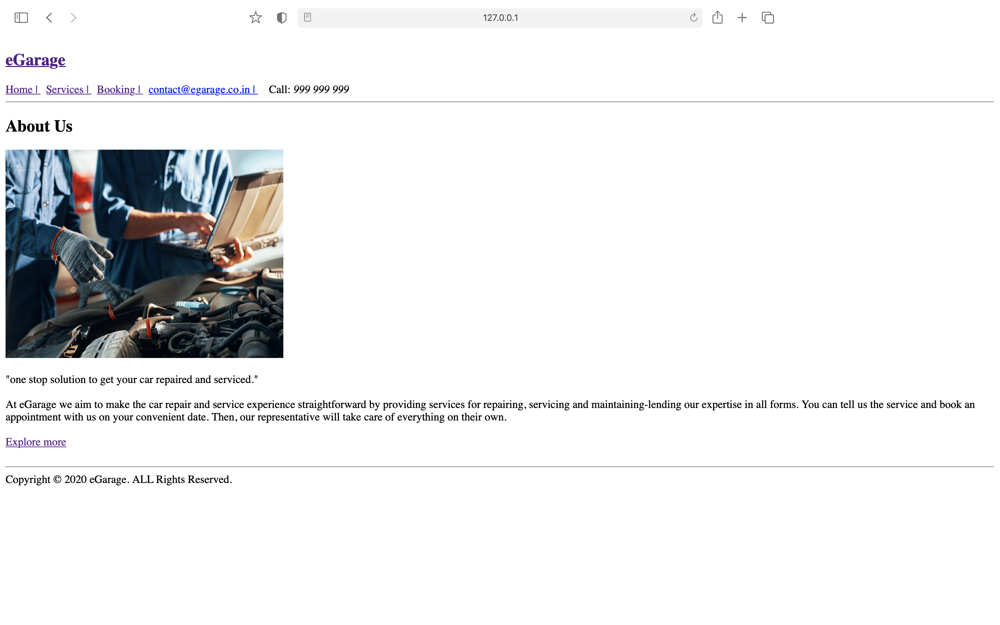
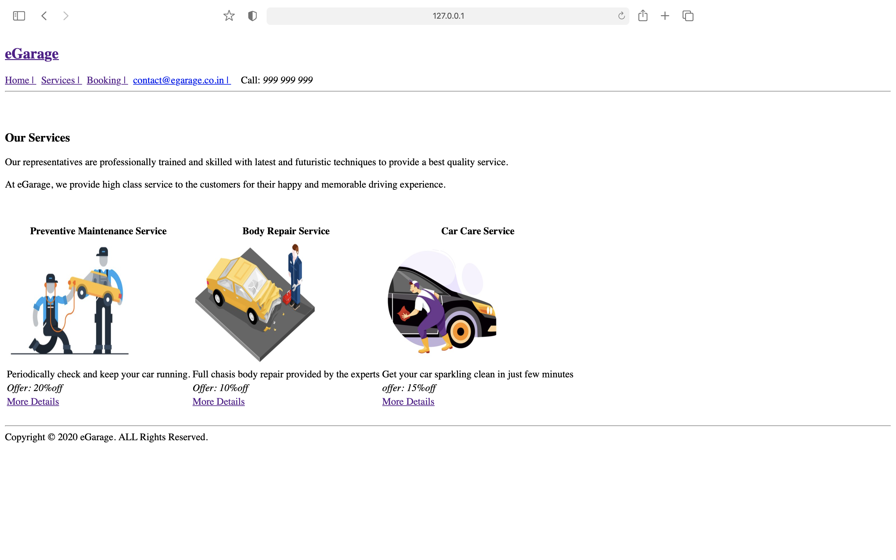
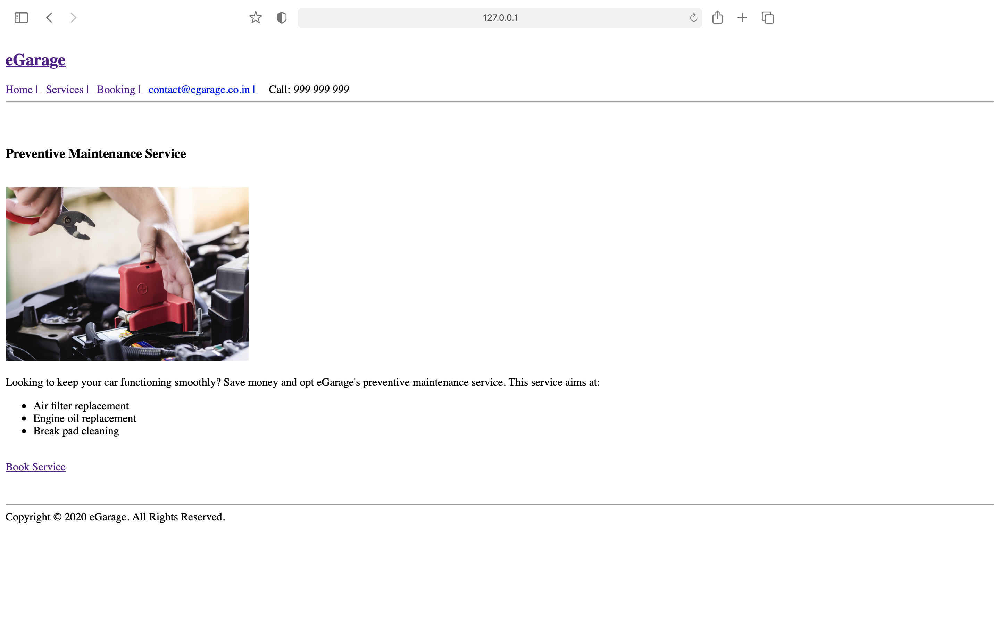
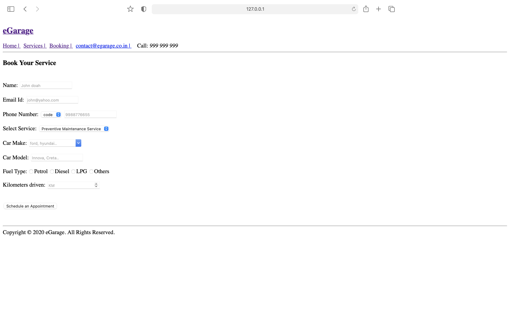
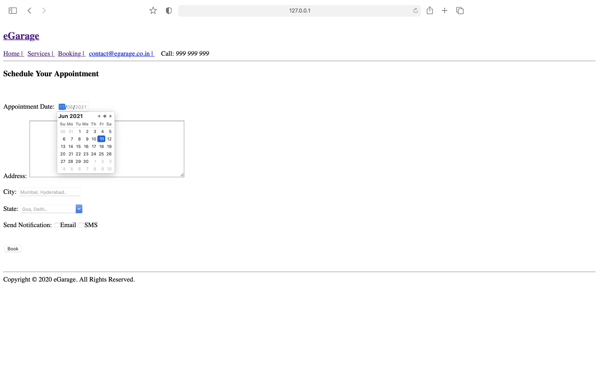
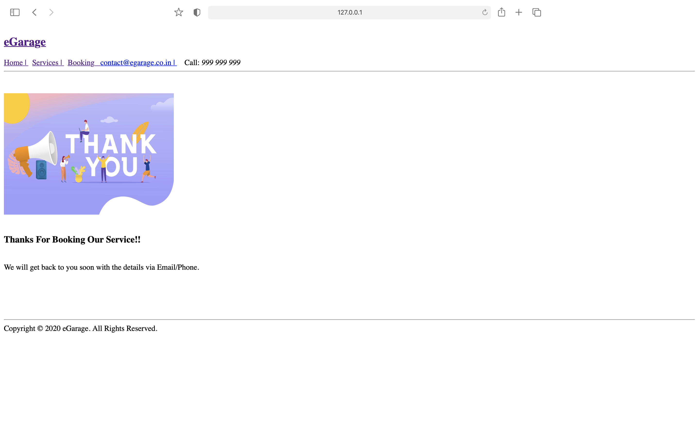
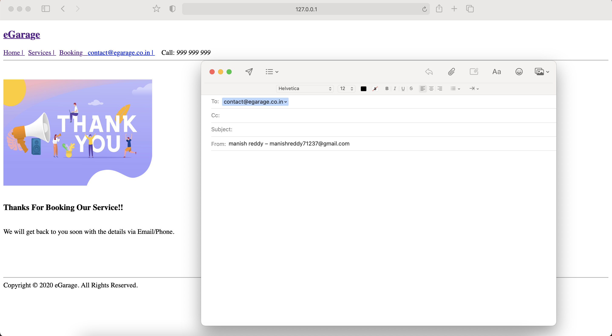

# eGarage 

eGarage is an online automobile services booking platform. It allows you to book a variety of services depending on the type of vehicle. 
You can select the service of your choice and enter booking details using simple forms.

## User Flow

### 1.Home 

For displaying information about the company.

### 2.Services

For displaying services provided by the company.

### 3.Preventive-maintenance-service (Type of Service)

For displaying about the service.

### 4.Booking

For displaying the form to book a particular service.

### 5.Appointment

For displaying the form to schedule an appointment.

### 6.Booking-Success

  

For displaying the confirmation message on booking
